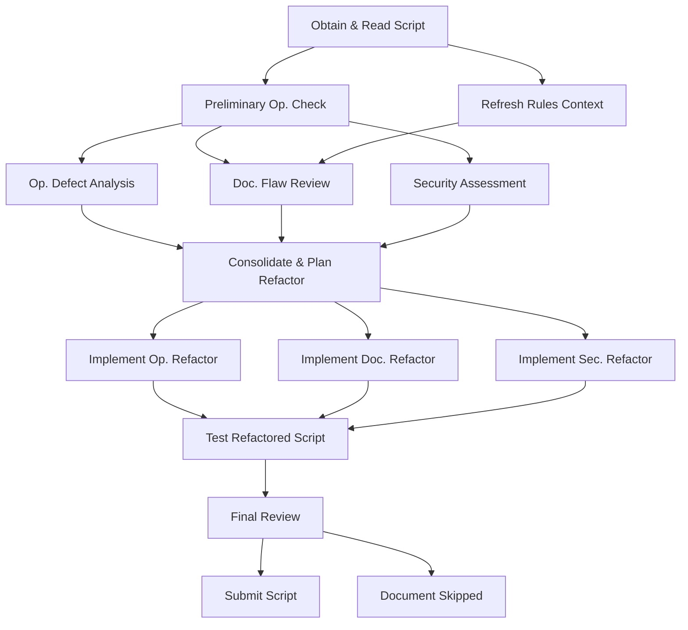

# Jules Project Status & Next Task Plan

## I. Session Transition & Onboarding Summary

This section summarizes the activities of the concluding session and provides essential context for a new AI session continuity.

**Key Activities & Achievements in Previous Session:**

1.  **Initial Repository Exploration & Summary:**
    *   The `r3oToy` repository was explored, and all existing files (`README.md`, `blocks/blocks_demo.r3`, `functions/alter-ask.r3`, `functions/alter.r3`, `project_rules.md`) were read and summarized.
    *   This summary was then written to `jules-summary.md` in the repository root (submitted on branch `add-repo-summary-file`).

2.  **Extensive Review & Refactoring of `functions/alter.r3`:**
    *   **Operational Review:** The script's logic was found to be robust with no significant operational defects.
    *   **Documentation Refactoring:** Adhering to `project_rules.md`, textual content (comments, `print` statements, "Lessons Learned") was significantly improved throughout the script (PTTS, backticking, clarity).
    *   **Bug Fixes:**
        *   An original runtime error in Example 03 ("y has no value") due to a `print` statement was identified and corrected.
        *   A failing test in Example 14 (`toggle-encode-strings/start-with-standard`) was diagnosed and resolved by modifying the test to dynamically generate its expected output, ensuring an accurate comparison.
    *   **Current Status:** `functions/alter.r3` is now fully operational, with all examples passing (as per user's last provided output) and documentation textually enhanced. The latest version was submitted on branch `fix-ex14-test-logic`.

**Challenges & Limitations Encountered:**

*   **Tooling Issues:** Persistent problems were encountered with the `replace_with_git_merge_diff` tool when attempting *structural* reformatting of function docstrings in `functions/alter.r3` (e.g., changing `function "doc" ...` to `function [{doc}] ...`). The tool consistently failed to find `SEARCH` blocks, preventing these specific structural updates. Textual modifications, however, were largely successful. This limitation should be kept in mind for future structural refactoring tasks.
*   **Repository Sync:** The AI's copy of the repository does not dynamically update during a session. New files added to GitHub after a session starts (like `arrays/arrays-TraeAI.r3`) are not accessible, necessitating a new session for the AI to obtain an updated repository copy.

**Essential Context for New Session:**

*   **AI Name:** Jules
*   **Project Focus:** `r3oToy` (GitHub: `gai095481/r3oToy`), a Rebol 3 Oldes Function Demonstration and Quality Assurance Framework.
*   **Critical Guiding Document:** `project_rules.md`. Strict adherence to its coding standards (Rebol 3 Oldes, Bulk build 3.19.0), documentation style (PTTS, no Oxford comma, backticking), and project management approach is required for all tasks.
*   **Immediate Next Task:** The primary goal for the new session is to execute the detailed project plan (outlined below in this document) for the **"Review and Refactor `arrays/arrays-TraeAI.r3`"** task. This involves obtaining the script in the new session and proceeding with Phase 1 (Initial Analysis).

## II. Detailed Plan: Review and Refactor `arrays/arrays-TraeAI.r3`

### Step 1: Understanding Your Project
*   **Project Name:** Review and Refactor `arrays/arrays-TraeAI.r3`
*   **Purpose:** To perform an extensive code review of the Rebol 3 Oldes script `arrays/arrays-TraeAI.r3` for operational defects, documentation flaws, and security concerns. Subsequently, refactor the code to address any findings, ensuring strict adherence to the standards defined in `project_rules.md`.
*   **Core Features (of this review and refactoring project):**
    *   **Comprehensive Analysis:** Detailed examination of the script's logic for operational correctness, including edge cases and potential runtime errors.
        *   *Reliability concern:* Ensuring the analysis itself is thorough and doesn't miss subtle bugs.
    *   **Documentation Audit:** Verification of all comments, docstrings, and printed outputs against `project_rules.md` for style, clarity, and accuracy (PTTS, backticking, etc.).
        *   *Reliability concern:* Ensuring documentation accurately reflects code behavior and that any proposed changes strictly follow project styling to maintain consistency.
    *   **Security Assessment:** Identification of any potential security vulnerabilities or areas where the script might be misused if adapted with untrusted data.
        *   *Reliability concern:* Clearly distinguishing between inherent vulnerabilities and general best-practice advice for users adapting the code.
    *   **Targeted Refactoring:** Implementing necessary code changes to address identified issues in operations, documentation, or security.
        *   *Reliability concern:* Ensuring refactoring improves the script without introducing regressions. All changes must be testable.
    *   **Verification and Testing:** Confirming that the refactored script operates correctly, all examples pass, and it meets the defined quality standards.
        *   *Reliability concern:* Developing new test cases if existing ones are insufficient to cover refactored areas.
*   **Technical Stack:**
    *   Rebol 3 Oldes branch (specifically Bulk build 3.19.0 or latest available).
    *   Target script: `arrays/arrays-TraeAI.r3`.
    *   Guiding document for standards: `project_rules.md`.
    *   No external libraries beyond standard Rebol natives.
*   **Key Reliability Goals (for the *refactored* `arrays/arrays-TraeAI.r3` script):**
    *   The script must execute without any Rebol syntax or runtime errors for all its intended examples.
    *   All code and documentation must strictly adhere to `project_rules.md`.
    *   Identified operational defects should be corrected.
    *   Documentation should be clear, accurate, and complete.
    *   Any security advice or necessary mitigations (if applicable) should be implemented or clearly documented.
    *   The refactored script should be demonstrably more robust or clear if issues were found.
*   **Definition of "Done" (for this review and refactoring project):**
    *   The comprehensive analysis (operational, documentation, security) is complete.
    *   A report of findings is generated (implicitly, by my plan steps).
    *   All necessary refactoring actions are implemented in `arrays/arrays-TraeAI.r3`.
    *   The refactored script is tested (e.g., by user execution, or simulated execution by me if it's a new script I'm helping write) and confirmed to be working correctly.
    *   The final, refactored script is successfully committed to the repository.
*   **Relevant Documents:**
    *   `arrays/arrays-TraeAI.r3` (the target script, which I currently cannot access but will in the new session).
    *   `project_rules.md` (for coding and documentation standards).

### Step 2 & 3: Iterative Task Breakdown & Phased Development for "Review and Refactor `arrays/arrays-TraeAI.r3`"

#### Phase 1: Initial Analysis & Preparation
*Reliability Gate: Script read, initial operational check complete, `project_rules.md` reviewed in context of the script.*

| ID  | Title                                  | Status  | Priority | Depends On | Description & Reliability Notes                                                                                                                                                                                             | Validation & Reliability Checks                                                                                                |
|-----|----------------------------------------|---------|----------|------------|-----------------------------------------------------------------------------------------------------------------------------------------------------------------------------------------------------------------------------|--------------------------------------------------------------------------------------------------------------------------------|
| R1A | Obtain & Read `arrays/arrays-TraeAI.r3`  | pending | Must     | -          | In the new session, access and read the full content of `arrays/arrays-TraeAI.r3`.   *Reliability Note:* Ensure the entire file is loaded correctly.                                                                       | - File content successfully loaded into AI context.                                                                              |
| R1B | Refresh `project_rules.md` Context     | pending | Must     | R1A        | Re-read `project_rules.md` specifically with the new script's context in mind, noting any rules that might be particularly relevant to array manipulations or the script's apparent purpose.                                   | - Key applicable rules from `project_rules.md` are noted.                                                                      |
| R1C | Preliminary Operational Check          | pending | Must     | R1A        | Perform a "mental walkthrough" or simulated execution of `arrays/arrays-TraeAI.r3` if its purpose is to run examples. Identify its main functions/goals.   *Reliability Note:* Catch any immediate, obvious runtime errors. | - Basic purpose of script understood. - No immediate showstopper errors preventing further analysis (e.g., major syntax issues). |

#### Phase 2: Detailed Review & Analysis
*Reliability Gate: Comprehensive review notes compiled for operational, documentation, and security aspects.*

| ID  | Title                                     | Status  | Priority | Depends On | Description & Reliability Notes                                                                                                                                                                                                                            | Validation & Reliability Checks                                                                                                                               |
|-----|-------------------------------------------|---------|----------|------------|------------------------------------------------------------------------------------------------------------------------------------------------------------------------------------------------------------------------------------------------------------|---------------------------------------------------------------------------------------------------------------------------------------------------------------|
| R2A | Operational Defect Analysis               | pending | Must     | R1C        | Systematically review script logic for correctness, efficiency, Rebol idioms (per `project_rules.md`), error handling, and edge cases related to array operations.   *Reliability Note:* Focus on loop constructs, indexing, `copy` usage, series modification. | - List of potential operational defects or areas for improvement compiled.                                                                                    |
| R2B | Documentation Flaw Review                 | pending | Must     | R1C, R1B   | Audit all comments, docstrings (structure and content), `print` statements, and "Lessons Learned" (if any) against `project_rules.md` (PTTS, backticks, clarity, etc.).   *Reliability Note:* Note any misleading or missing documentation.                 | - List of documentation flaws and non-compliance with `project_rules.md` compiled.                                                                          |
| R2C | Security Concern Assessment               | pending | Must     | R1C        | Analyze for security risks: use of `load`/`do` with dynamic data, handling of external inputs (if any), path manipulation, unsafe `mold` usage.   *Reliability Note:* Given it's an array script, focus on data integrity if arrays come from external sources. | - List of any security considerations or vulnerabilities compiled.                                                                                            |
| R2D | Consolidate Findings & Plan Refactoring   | pending | Must     | R2A,R2B,R2C| Compile all findings. Prioritize issues. Create a specific, actionable sub-plan for refactoring based on findings.                                                                                                                                 | - Clear refactoring sub-plan documented. - Agreement with user on refactoring priorities if feedback is sought.                                                |

#### Phase 3: Refactoring & Verification
*Reliability Gate: Refactored script passes all relevant tests, documentation is up to standard, and the script is stable.*

| ID  | Title                                        | Status  | Priority | Depends On | Description & Reliability Notes                                                                                                                                                                                                                         | Validation & Reliability Checks                                                                                                                                                                                             |
|-----|----------------------------------------------|---------|----------|------------|---------------------------------------------------------------------------------------------------------------------------------------------------------------------------------------------------------------------------------------------------------|-----------------------------------------------------------------------------------------------------------------------------------------------------------------------------------------------------------------------------|
| R3A | Implement Operational Refactoring            | pending | Must     | R2D        | Apply code changes to fix operational defects and improve logic/efficiency.   *Reliability Note:* Ensure changes are minimal necessary and don't introduce regressions. Use `copy` when modifying series to avoid side effects unless intended.                 | - Code changes implemented. - Unit tests (if any provided by user, or simple new ones for critical logic) pass. - Code review of changes (self or user).                                                                 |
| R3B | Implement Documentation Refactoring          | pending | Must     | R2D        | Apply changes to fix documentation flaws.   *Reliability Note:* Be mindful of tooling limitations for structural docstring changes encountered previously; prioritize textual corrections if structural changes prove difficult.                             | - Documentation changes implemented. - `project_rules.md` styling for comments/text is met.                                                                                                                               |
| R3C | Implement Security Refactoring (if any)      | pending | Should   | R2D        | Apply code changes to address any identified security vulnerabilities or mitigate risks.                                                                                                                                                                | - Security-related code changes implemented and verified.                                                                                                                                                                     |
| R3D | Test Refactored Script                       | pending | Must     | R3A,R3B,R3C| Execute the refactored script. If it runs examples, ensure all pass. If it's a library, test its functions.   *Reliability Note:* Test with edge case data if appropriate based on findings.                                                                | - Script executes without errors. - All internal examples/tests pass. - User confirms expected behavior if script is interactive or produces specific output.                                                           |
| R3E | Final Review of Refactored Script            | pending | Must     | R3D        | Perform a final read-through of the script for cohesion, correctness, and adherence to all standards.                                                                                                                                                 | - Final check-off against `project_rules.md`. - Script is considered stable and improved.                                                                                                                                     |

#### Phase 4: Final Polish / Future Ideas (Optional)

| ID  | Title                               | Status  | Priority | Depends On | Description & Reliability Notes                                                                                             | Validation & Reliability Checks                                                               |
|-----|-------------------------------------|---------|----------|------------|-----------------------------------------------------------------------------------------------------------------------------|-----------------------------------------------------------------------------------------------|
| R4A | Submit Refactored Script            | pending | Must     | R3E        | Commit the final, refactored `arrays/arrays-TraeAI.r3` with a comprehensive commit message detailing changes made.              | - Code successfully submitted to the repository.                                                |
| R4B | Document Skipped Items (If Any)     | pending | Could    | R3E        | If any planned refactorings were deferred (e.g., due to tooling or complexity), list them for future consideration.             | - List of deferred items created if applicable.                                                 |

### Step 4: Visual Task Dependencies (MermaidJS)

### Step 5: Key Reliability Risks & Prevention (for `arrays/arrays-TraeAI.r3` review)

| Potential Reliability Risk                                  | Prevention Strategy                                                                                                                               |
|-------------------------------------------------------------|---------------------------------------------------------------------------------------------------------------------------------------------------|
| Misinterpreting Array Logic / Off-by-one errors             | Carefully trace array manipulations, especially with `skip`, `copy/part`, `index?`, `length?`. Write small test cases for complex Rebol array idioms if unsure. |
| Incomplete Adherence to `project_rules.md` Documentation    | During documentation refactoring (R3B), have `project_rules.md` open and systematically check each comment/string against PTTS, backticking etc. |
| Regressions after Refactoring                               | If significant logic changes are made (R3A), ensure robust testing (R3D), including any relevant edge cases identified during analysis (R2A).         |

---
