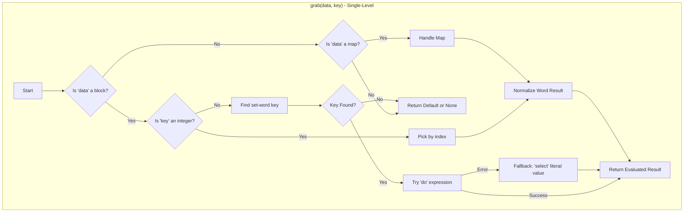

## The `grab` function: A Technical Guide

*A Comprehensive Guide to r3oToy's Premier Data-Access Function*

The `grab` function provides a unified, robust and safe interface for retrieving values from
primary aggregate data structures: `block!` and `map!`.
It is designed to replace direct, often-unforgiving, use of native functions like `pick` and `select` in application code,
offering sophisticated path traversal and intelligent error handling without aborting script execution.

### Formal Definition

The formal usage for the function is:
`grab data key`

**Arguments:**

- **`data`** `[any-type!]`: The source data structure to access.  The function is optimized for `block!` and `map!`,
but will safely handle `none!` or any other datatype by returning a default value.
- **`key`** `[any-word! string! integer! decimal! block!]`: The identifier for the element to retrieve.
Its interpretation depends on the `data` type and active refinements.

**Refinements:**

- `/path`: Instructs `grab` to interpret the `key` argument as a `block!` of keys or indices for recursive, deep-level traversal.
- `/default` `[any-type!]`: Provides a fallback value to be returned in the event of any lookup failure.
If `/default` is not used, `none` is returned on failure.

### Core Functionality and Behavior

The `grab` function operates in two primary modes: _single-level lookup_ and _path traversal_.

#### Single-Level Lookup (Default Mode)

When used without `/path`, `grab` retrieves a single value from the top level of the `data` structure.  Its behavior is specialized for the `data` type.

##### For `block!` (List) Data

- **With `integer!` `key`**: `grab` performs a positional lookup.
It correctly normalizes the quirky `word!` returns from `pick` for stored `logic!` or `none!` values into their proper datatypes.
- **With `word!` `key`**: `grab` performs a key-value lookup, searching for the corresponding `set-word!` (e.g., `my-key:`).  It correctly handles two critical scenarios:
    1.  **Literal Values**: Retrieves simple literals like strings, integers etc.
    2.  **Constructor Expressions**: The function can safely evaluate multi-part constructor expressions (e.g., `make map! [...]`) to return the fully-formed value.  This is accomplished using a robust `try [do ...]` pattern.
- **With Other `key` Types**: The function correctly identifies invalid key types (e.g., `decimal!`, `block!`) for a block lookup and safely returns `none` or the default value.

##### For `map!` Data

- `grab` performs a standard, hashed key lookup.
It incorporates logic to normalize the `word!` representations of `none!`, `true!`, and `false!` that the native `select` function returns into their proper datatypes.

#### Path Traversal (`/path` Refinement)

When the `/path` refinement is used, `grab` interprets the `key` argument as a `block!` of path steps to be traversed in sequence.

```rebol
>> path-data: make map! [
    config: [
        database: make map! [
            host: "localhost"
        ]
    ]
]

>> grab/path path-data ['config 'database 'host]
== "localhost"
```

The path traversal logic is intelligent and robust:
- It iterates through the path steps, recursively calling the single-level `grab` logic for each step.
- It can seamlessly transition between container types (e.g., from a `map!` to a `block!` and back to a `map!`).
- If any step in the traversal fails (e.g., a key is not found or an intermediate value is not a container),
the process halts immediately and returns `none` or the default value.

### Documented Limitations for `grab`

- **Contextual Aliases**: The powerful block-parsing logic that allows `grab` to evaluate constructors cannot safely resolve variable aliases
that depend on an outer scope.  For example, it cannot resolve `alias: user` if `user` is not defined locally within the `grab` function.
This is a designed limitation to ensure predictability and security.

---
This data structure, a block of blocks (where each inner block acts as a record), is a very common pattern in Rebol.

There are two primary ways to access items in this `system-items` block using `grab`: by **positional index** and by **simulated key-value lookup**.
The `/path` refinement is ideal for the latter.

### **Demonstration: Accessing a Block of Records**

Here we demonstrate how to use the `grab` function to retrieve data from a `block!` that contains nested records.

**The Data Structure:**

Our example data is a `block!` named `system-items`. Each element in this block is another `block!` that
contains three items: a path-like string key, a description and the actual Rebol system data.

```rebol
;; Assume `grab` is loaded in the session.
system-items: [
    ["system/version" "Interpreter version..." system/version]
    ["system/platform" "Operating system platform..." system/platform]
    ["system/options/path" "Current working directory..." system/options/path]
    ...
]
```

#### **Method 1: Positional Access**

If you know the exact position of the record you need, you can use `grab` with integer indices.
To get the third record's data, you would first `grab` the record at position `3`, then `grab` the data at position `3` within that inner block.

The `/path` refinement makes this trivial:

```rebol
>> ;; Get the data from the 3rd record (system/options/path):
>> grab/path system-items [3 3]
== %/C/Users/YourUser/Documents/
```

- **`[3 3]`**: The path tells `grab` to go to the **3rd** element of the outer block, then get the **3rd** element of that inner block.

To get the description string for the second record:

```rebol
>> ;; Get the description from the 2nd record (system/platform):
>> grab/path system-items [2 2]
== "Operating system platform..."
```

#### **Method 2: Key-Value Lookup Simulation (More Robust)**

A more robust and readable method is to treat the first item in each record as a key.
This avoids relying on fixed positions, which might change if the data structure is modified.

However, the `grab` function is designed to look for `set-word!` keys (`key:`) in blocks, not string keys.
Therefore, a simple `grab/path system-items ["system/version" 3]` will not work directly.

This scenario highlights a perfect opportunity for a small helper function that iterates through the records.

```rebol
grab-item: function [
    "USE: Find a record in system-items by its key and grab its associated value."
    key-string [string!] "The key to match (e.g., 'system/version')."
    index [integer!] "The index of the value to grab from the matching record (1, 2, or 3)."
][
    foreach record system-items [
        ;; Ensure the first item in the record matches our key:
        if key-string = first record [
            ;; Use `grab` to safely get the indexed item from the record:
            return grab record index
        ]
    ]
    return none ;; Return `none` if no record was found.
]

>> grab-item "system/version" 3
== 3.19.0

>> grab-item "system/options/home" 3
== %/C/Users/YourUser/

>> grab-item "system/platform" 2
== "Operating system platform..."

>> grab-item "non-existent-key" 1
== none
```
---

### **Analysis of Lettercase Sensitivity**

A critical aspect of the `grab` function's behavior is its handling of letter case sensitivity during key-based lookups.  The function's behavior is not uniform; rather, it is inherited directly from the default semantics of the underlying Rebol datatype being accessed at each step of a lookup.  A clear understanding of this distinction is essential for predictable results, particularly when using the `/path` refinement.

#### Lettercase Behavior with `map!` Datatypes

When the `data` argument (or an intermediate value during a path traversal) is a `map!`, `grab` performs a **case-sensitive** lookup for that step.  This is a direct consequence of the `map!` datatype's design, which treats keys as letter case-sensitive to allow for precise matching.

```rebol
>> data-map: make map! [
    key: "lowercase"
    KEY: "UPPERCASE"
]

>> grab data-map 'key
== "lowercase"

>> grab data-map 'KEY
== "UPPERCASE"
```
In this scenario, `'key` and `'KEY` are treated as two entirely distinct entries.

#### Lettercase Behavior with `block!` Datatypes

Conversely, when performing a key-based lookup on a `block!` containing `set-word!` keys, `grab` performs a **case-insensitive** lookup by default.  This behavior is inherited from the standard comparison semantics for `word!` types in Rebol.

```rebol
>> data-block: [
    key: "value"
]

>> grab data-block 'key
== "value"

>> grab data-block 'KEY
== "value"
```
In this case, `grab` successfully finds the `set-word!` `key:` when searching for `'KEY`.  It is important to note that while the *lookup* is case-insensitive, if a block contained both `key: 1` and `KEY: 2`, a search for `'key` would find the first match and return `1`.

#### Lettercase Implications for Path Navigation

This datatype-dependent behavior extends directly to the `/path` refinement.  The case sensitivity of each lookup is determined by the type of the *current* data segment being traversed.

```rebol
;; If `block-structure` contains block keys, this search is case-insensitive:
grab/path block-structure ['User 'Profile]

;; If `map-structure` contains map keys, this search is case-sensitive:
grab/path map-structure ['User 'Profile]
```

#### Summary of Lettercase Sensitivity Behavior

| Data Type Being Searched | Key Lookup Behavior | Inherited From |
| :--- | :--- | :--- |
| `map!` | **Case-Sensitive** | Default `map!` key semantics. |
| `block!` | **Case-Insensitive** | Default `word!` comparison semantics. |

This difference in behavior is not a flaw in the `grab` function but rather a correct implementation that respects the distinct design philosophies of Rebol's primary data structures.  Developers must be mindful of the data type at each step of a path to predict the outcome of key-based lookups accurately.  Future enhancements may include `/case` or `/case-insensitive` refinements to provide explicit control over this behavior.

---
### Overall Conclusion

*   For **simple positional access** in nested blocks, `grab/path` with a path of integers is fast and effective.
*   For more complex, **key-based lookups** in a block of records, the best practice is to use a simple `foreach` loop combined with `grab` to provide safe access once the correct record is found.

---

---
### Features Considered for Future Releases

Most Immediately Valuable
The `/convert`, `/multi-path` and `/trace` refinements below probably provide the highest utility-to-complexity ratio for real-world usage.

#### Core Robustness & Usability
- Recursion Depth Protection: Prevent infinite loops when traversing data with circular references.
- `/secure`: To sanitize path input and prevent traversal attacks.
- `/string-path`: To accept paths as a delimited `string!` (e.g., `"config/database/host"`).
- `/exists?`: Return true/false if path exists without getting a value.

#### Enhanced Path Operations
- `/case-insensitive`: Make word-based lookups case-insensitive.
- `/pattern`: Support wildcard patterns in keys (e.g., user*, *_config).
- `/all`: Return all matching values when path contains patterns.
- `/multi-path`: Accept multiple path alternatives, return first successful match.
- Better array operations: Support for negative indices, slice notation.

#### Data Transformation & Type Handling
- `/validate`: Ensure returned values meet criteria (type, range, pattern).
- `/convert`: Automatically convert return values to specified types (e.g., strings to integers, blocks to maps).
- `/transform`: Apply a transformation function to the result before returning.

#### Batch & Performance Features
- `/batch` refinement: Process multiple fields at once, return block of results.
- `/lazy` refinement: Return a function that evaluates the path when called.
- `/cache` refinement: Cache path lookups for repeated access to same structure.

#### Data Structure Extensions
- `/flatten`: Handle nested structures more intuitively.
- `/merge`: Combine results from multiple paths.

#### Enhanced Error Handling & Debugging
- `/strict`: Fail fast on any path segment that doesn't exist.
- `/trace` refinement: Return detailed path traversal information.

#### Recommended implementation order
##### Highest Value, Easiest to Implement (Quick Wins)

Recursion Depth Protection (Critical Stability)
- `/secure` (Critical Security)
- `/string-path` (High-Value Convenience)
- `/strict` (Useful Alternative Behavior)

##### Next Tier (Powerful Features)
- `/exists?`
- `/case-insensitive`

##### Advanced / Specialized (Implement as needed)
- `/transform`, `/convert`, `/validate` (Easy but niche).
- `/batch`, `/multi-path` (More complex for specific use cases).

##### Re-evaluate Later (Major undertakings representing a significant increase in complexity)
- `/pattern`, `/all`, `/lazy`, `/cache`
- _Better Array Operations_

 ---
 
 ```
=== Starting QA tests for `grab` ===

--- Core Functionality Tests (Happy Path) ---
✅ PASSED: Core: Should get the first element.
✅ PASSED: Core: Should get a middle element.
✅ PASSED: Core: Should get the last element.

--- Invalid Input Tests ---
✅ PASSED: Invalid Input: Should return none for a none block.
✅ PASSED: Invalid Input: Should return default for a none block.

--- Out-of-Bounds Index Tests ---
✅ PASSED: Out-of-Bounds: Should return none for index 0.
✅ PASSED: Out-of-Bounds: Should return none for a negative index.
✅ PASSED: Out-of-Bounds: Should return none for an index greater than length.
✅ PASSED: Out-of-Bounds: Should return default for an index greater than length.
✅ PASSED: Out-of-Bounds: Should return default for index 0.

--- Default Value Edge Case Tests ---
✅ PASSED: Default: Should return the provided default value on failure.
✅ PASSED: Default: Should return `none` when it is explicitly provided as the default.
✅ PASSED: Default: Should handle a `true` logical as a default value.

--- Enhanced Edge Case Tests ---
✅ PASSED: Edge Case: Should return none for empty block access.
✅ PASSED: Edge Case: Should return default for empty block access.

--- `/path` Refinement Support Tests ---
✅ PASSED: path!: Should get a value from a nested block.
✅ PASSED: path!: Should get a value from a deeply nested map.
✅ PASSED: path!: Should return none if path fails.
✅ PASSED: path!: Should return default if path fails.
✅ PASSED: path!: Should work with a single-element path.
✅ PASSED: path!: Should fail gracefully if an intermediate value is none.
✅ PASSED: path!: Should return none for an empty path.
✅ PASSED: path!: Should return default if key is not a block.

--- `map!` Support Tests (Core) ---
✅ PASSED: Map: Should get value by word key.
✅ PASSED: Map: Should get integer value from map.
✅ PASSED: Map: Should get logical value from map.
✅ PASSED: Map: Should return none for missing key.
✅ PASSED: Map: Should return default for missing key.

--- Missing `map!` Support Tests (Core) ---
✅ PASSED: Map: Should get value by word key.
✅ PASSED: Map: Should get integer value from map.
✅ PASSED: Map: Should get logical value from map.
✅ PASSED: Map: Should return none for missing key.
✅ PASSED: Map: Should return default for missing key.

--- WORD-BASED BLOCK ACCESS TESTS ---
✅ PASSED: Block Word: Should get value by word key.
✅ PASSED: Block Word: Should get integer value by word.
✅ PASSED: Block Word: Should get string value by word.
✅ PASSED: Block Word: Should return none for missing word.
✅ PASSED: Block Word: Should return default for missing word.

--- MIXED BLOCK ACCESS TESTS ---
✅ PASSED: Mixed: Should get integer at index 1.
✅ PASSED: Mixed: Should get string at index 2.
✅ PASSED: Mixed: Should get logical at index 3.
✅ PASSED: Mixed: Should get none value at index 4.
✅ PASSED: Mixed: Should get block at index 5.

--- LARGE INDEX TESTS ---
✅ PASSED: Large Index: Should return none for very large index.
✅ PASSED: Large Index: Should return none for very negative index.
✅ PASSED: Large Index: Should return default for large index.

--- PATH WITH WORDS TESTS ---

Running 4 code blocks 10 times.
------------------------------------------------------------------------------------------------------------------------------------------------------------------------------------
✅ PASSED: Path Word: Should navigate using word path.
✅ PASSED: Path Word: Should navigate deep word path.
✅ PASSED: Path Word: Should navigate very deep word path.
✅ PASSED: Path Word: Should return none for missing word in path.

--- MIXED DATA TYPE TESTS ---
✅ PASSED: Mixed Path: Should handle integer then word.
✅ PASSED: Mixed Path: Should handle word then integer.
✅ PASSED: Mixed Path: Should return none for missing mixed path.

--- EMPTY VALUE TESTS ---
✅ PASSED: Empty: Should get empty string.
✅ PASSED: Empty: Should get zero integer.
✅ PASSED: Empty: Should get false logical.
✅ PASSED: Empty: Should get none value.

--- SINGLE ELEMENT TESTS ---
✅ PASSED: Single: Should get value from single-element block.
✅ PASSED: Single: Should return none for index beyond single element.
✅ PASSED: Single Map: Should get value from single-key map.

--- PATH EDGE CASES ---
✅ PASSED: Path Edge: Should return none for empty block with empty path.
✅ PASSED: Path Edge: Should return default for empty block with empty path.
✅ PASSED: Deep Path: Should navigate very deep structure.
✅ PASSED: Deep Path: Should return none for invalid deep path.

--- ⚠️ NESTED MAP IN BLOCK TESTS (UNIMPLEMENTED: CANNOT SOLVE) ---

--- NESTED BLOCK IN MAP TESTS ---
✅ PASSED: Map Block: Should access block within map.
✅ PASSED: Map Block: Should access nested values in map block.

--- INVALID FIELD TYPE ---
✅ PASSED: Invalid Field: Should return `none` for string field on block.
✅ PASSED: Invalid Field: Should return `none` for decimal field.
✅ PASSED: Invalid Field: Should return the default for block field on non-path call.

============================================
✅ ALL TESTS PASSED
============================================
 ```

### **Logic Flow Validation for `grab` function**

| Logic Flow Statement | Code Implementation | Validation & Analysis |
| :--- | :--- | :--- |
| "Check if the `/path` refinement is used." | `if path [...]` | ✅ **Accurate.** This is the first check in the function. |
| "If the `key` is not a `block!` or is empty, the path is invalid... returns `default-value` or `none`." | `if any [not block? key empty? key] [return either default ...]` | ✅ **Accurate.** The code correctly implements this guard clause. |
| "It iterates through each `step`... recursively calls `grab`... If any step returns `none`, the loop breaks." | `foreach step key [...] current: grab current step; if none? :current [break]` | ✅ **Accurate.** This perfectly describes the recursive loop and its early exit condition. |
| "If the current data segment is not a `block!` or `map!`, the loop breaks." | `if not any [block? :current map? :current] [current: none; break]` | ✅ **Accurate.** This guard correctly prevents traversal into non-container types. |
| "After the loop, it returns the final value found, or the `default-value`..." | `return either all [none? :current default] [default-value] [current]` | ✅ **Accurate.** This correctly describes the final return logic for the `/path` refinement. |
| "Validates the `data` input. If it is not a `block!`, `map!`, or `none!`..." | `if not any [block? data map? data none? data] [return ...]` | ✅ **Accurate.** The single-level logic begins with this type validation. |
| "If `data` is a `block!`: ... `block!` and `decimal!` keys are invalid..." | `if block? key [...]` and `if decimal? key [...]` | ✅ **Accurate.** Your final version of the code correctly rejects `block!` and `decimal!` keys in non-path mode. |
| "If `key` is an `integer!`, it uses `pick`... then normalizes the result..." | `if integer? key [value: pick data key; case [...]]` | ✅ **Accurate.** The logic for `integer!` keys performs both the `pick` and the subsequent normalization correctly. |
| "If `key` is a `word!`, it begins sophisticated parsing... evaluate... `try [do ...]`... falls back to selecting..." | `if word? key [...] result: try [do ...]; if error? result [return select ...]` | ✅ **Accurate.** This correctly and concisely describes the complex but robust "Try / Fallback" pattern for handling word-keyed lookups in blocks. |
| "If `data` is a `map!`, it uses `find`... `select`... then normalizes the result..." | `if map? data [if find data key [value: select data key; case [...]]]` | ✅ **Accurate.** This perfectly describes the map handling logic, including the critical existence check with `find` and the normalization `case` block. |
| "In any failure case... it returns the `default-value`... or `none`." | Multiple `return either default [default-value] [none]` statements. | ✅ **Accurate.** The function consistently provides the correct fallback value at every failure point. |

### **Conclusion: No Defects Found**

The logic flow description you have crafted is **excellent**. It is a **complete, accurate, and faithful representation** of the final, working `grab` function's behavior.

-   **No Inefficiencies Documented:** The description doesn't claim any performance characteristics that the code doesn't have. It accurately reflects the logic.
-   **No Defects:** There are no logical contradictions between the description and the code's execution path.
-   **No Inconsistencies:** The description correctly captures the different behaviors for `block!` and `map!` lookups and correctly explains the pathing mechanism.

