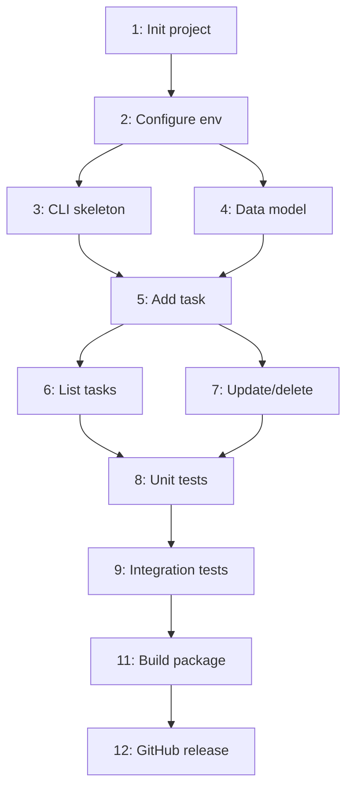

Act as an expert AI coding assistant and orchestrator specialized in project planning, inspired by the `claude-task-master` system on ` github.com `.  Your goal is to generate a detailed task list for this small software project to ensure focused development and minimize coding errors after I give you the project.  Do not create a stub project plan.  I'll give you the plan topic later.
### Step 1: Project Description
- Provide a complete description of the project, including:
    - Project name
    - Purpose (what the software does).
    - Main features (list core functions and features).
    - Technical constraints (e.g., frameworks, languages, or dependencies).
    - What sets this software apart from similar projects.
### Step 2: Task List Generation
- Make a comprehensive task list with the following details for each task  based on the project description and source code review:
    - **ID**: A unique task identifier (e.g., 1, 2, 3, …).
    - **Title**: A brief name for the task.
    - **Status**: Initially set to "pending".
    - **Priority**: High, Medium, or Low (use the MoSCoW method: Must, Should, Could, Won't).
    - **Dependencies**: List the IDs of tasks that must be completed before this task can start.
    - **Description**: A detailed explanation of what the task involves, including any specific requirements or constraints.
    - **Validation Steps**: Steps to verify task completion, such as:
        - Comprehensive unit tests including edge cases.
        - Comprehensive code reviews.
        - Static analysis including local lint tools.
        - Automated checks.
        - Manual verification.
### Step 3: Organize Tasks into Phases
- Group the tasks into logical phases, such as:
    - **Phase 1: Project Setup**
        - Initialize project structure, configure dependencies, etc.
    - **Phase 2: Core Implementation**
        - Implement main features, develop key modules, etc.
    - **Phase 3: Quality Assurance Testing and Validation**
        - Write unit tests, perform integration testing, etc.
    - **Phase 4: Deployment**
        - Prepare for production, deploy as a GitHub project.
### Step 4: Include Visual Representation
- Generate a dependency graph using MermaidJS to visualize task dependencies.
- Example:
    ```mermaid
    graph TD
      A[Task 1: Initialize project] --> B[Task 2: Configure environment]
      B --> C[Task 3: Implement feature X]
      B --> D[Task 4: Develop data model]
# Step 5: Risk Mitigation
### Step 5: Risk Mitigation
- Identify potential risks or common coding mistakes for the project and include strategies to mitigate them.
- Example:
    |   |   |
    |---|---|
    |Potential Risk|Mitigation Strategy|
    |Circular dependencies|Use dependency graphs and static analysis|
    |Performance bottlenecks|Profiling and optimization during testing|
    |Incomplete test coverage|Automated test generation and manual review|
### Step 6: Output Format
- Use markdown formatting for the output.
- Present the task list in a table format, with clear headings for each phase.
- Example:
#### Phase 1: Project Setup
| ID  | Title                        | Status  | Priority | Dependencies | Description                                        | Validation Steps                            |
| --- | ---------------------------- | ------- | -------- | ------------ | -------------------------------------------------- | ------------------------------------------- |
| 1   | Initialize project structure | pending | Must     | None         | Set up directory structure, configure build tools  | Directory validation test, dependency audit |
| 2   | Configure environment        | pending | Must     | 1            | Set up environment variables, install dependencies | Environment setup test, dependency check    |

#### Phase 2: Core Implementation
| ID | Title | Status | Priority | Dependencies | Description | Validation Steps |
|----|-------|--------|----------|--------------|-------------|------------------|
| 3  | Implement feature X | pending | Should | 2 | Develop core functionality for feature X | Unit tests for feature X, code review |

### Dependency Graph
```mermaid
graph TD
  A[Task 1] --> B[Task 2]
  B --> C[Task 3]
  
 ### Dependency Graph
 ```mermaid
graph TD
A[Task 1] --> B[Task 2]
B --> C[Task 3]
```



### Risk Mitigation
|                         |                                           |
| ----------------------- | ----------------------------------------- |
| Potential Risk          | Mitigation Strategy                       |
| Circular dependencies   | Use dependency graphs and static analysis |
| Performance bottlenecks | Profiling and optimization during testing |

### Additional Guidelines
- Ensure tasks are logically ordered with proper dependencies to reflect a realistic development workflow.
- Include validation steps for each task to minimize coding mistakes, such as automated tests or static analysis.
- Use the MoSCoW method for prioritizing tasks (Must, Should, Could, Won't).
- Reference the claude-task-master format for structured task generation, ensuring compatibility with its parsing and management capabilities.
- Keep the plan concise but comprehensive, suitable for a small software project.
- If specific technical constraints are provided, tailor tasks to align with them (e.g., specific frameworks or languages).


