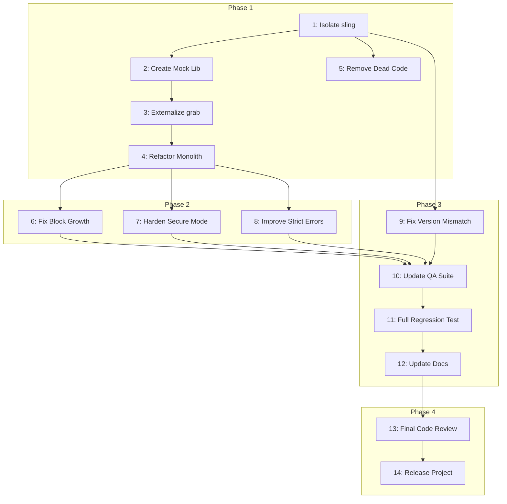

Excellent. Based on your detailed analysis, here is the revised and hardened project plan for refactoring the `sling` function.

### **Step 1: Project Description**

-   **Project Name:** `sling` Function Refactoring and Hardening (v2)
-   **Purpose:** To refactor the existing `sling` "super-setter" Rebol function to improve its maintainability, readability, and robustness by addressing architectural complexity and fixing subtle operational defects identified in a code review.
-   **Main Features:** (Unchanged)
    -   Unified interface for modifying `block!`, `map!`, and `object!` data structures in place.
    -   `/path`, `/create`, `/report`, `/strict`, and `/secure` refinements.
-   **Technical Constraints:** Must be written in Rebol/Bulk 3.19.0 (Oldes Branch). The refactored function will depend on a canonical `grab` function provided by a mock shared library for this project.
-   **What sets this software apart:** `sling` is unique in its ambition to provide a single, fire-and-forget function that handles a wide variety of mutation scenarios across multiple Rebol data types. This refactoring effort will make it not just functional, but maintainable and robust.

### **Step 2 & 3: Task List and Phases**

#### **Phase 1: Project Setup & Core Refactoring**
*This phase focuses on establishing a clean working environment and tackling the primary architectural and dependency issues.*

| ID  | Title                               | Status  | Priority | Dependencies | Description                                                                                                                                                                                             | Validation Steps                                                                                               |
| --- | ----------------------------------- | ------- | -------- | ------------ | ------------------------------------------------------------------------------------------------------------------------------------------------------------------------------------------------------- | -------------------------------------------------------------------------------------------------------------- |
| 1   | Isolate `sling` for Refactoring     | pending | Must     | None         | Create a new, dedicated development file (`sling-refactor-dev.r3`) containing only the `sling` function and its test harness to isolate the work.                                                  | Manual verification that the new file exists and contains the necessary code.                                  |
| 2   | Create Mock Shared Library          | pending | Must     | 1            | Create a mock `common-lib.r3` file that defines a canonical `grab` function. This resolves the dependency ambiguity for the refactoring work.                                                       | Code review of the mock library file.                                                                          |
| 3   | Externalize `grab` Dependency       | pending | Must     | 2            | Remove the bundled `grab` function from `sling-refactor-dev.r3`. Update the test harness to load the canonical `grab` from `common-lib.r3`.                                                         | Code review to confirm `grab` is removed. Run a test to ensure the external dependency is loaded correctly.     |
| 4   | Refactor Monolithic `/path` Logic   | pending | Must     | 3            | Break the main `sling/path` logic into smaller, helper functions. The refactoring must also simplify state management to perform only a single, stateful path traversal, eliminating inefficient re-traversals. | Code review confirming the monolith is broken down. Static analysis to check for reduced complexity.             |
| 5   | Remove Dead Code                    | pending | Should   | 1            | Remove the unused `grab-item` function and its reference to the undefined `system-items` variable from `sling-refactor-dev.r3`.                                                                     | Code review to confirm the function has been removed.                                                          |

#### **Phase 2: Defect Remediation & Hardening**
*With the core refactoring complete, this phase addresses the specific bugs and logical flaws identified.*

| ID  | Title                          | Status  | Priority | Dependencies | Description                                                                                                                                                                                    | Validation Steps                                                                                                                                                                 |
| --- | ------------------------------ | ------- | -------- | ------------ | ---------------------------------------------------------------------------------------------------------------------------------------------------------------------------------------------- | -------------------------------------------------------------------------------------------------------------------------------------------------------------------------------- |
| 6   | Fix Block Growth Logic         | pending | Must     | 4            | Correct the `insert/dup` logic to unambiguously use the `none!` value for padding when growing a block. Document the rationale for this choice in the code comments.                             | Add new unit tests specifically for out-of-bounds block creation and padding. Code review of the fix.                                                                          |
| 7   | Harden Secure Mode Type Checks | pending | Should   | 4            | Harden `/secure` mode to explicitly allow `string!` keys for maps, in addition to `any-word!`. The validation logic should be updated to reflect this, ensuring strings are not rejected.             | New unit tests for `/secure` mode with `string!` keys. Code review.                                                                                                            |
| 8   | Implement Specific Strict Errors | pending | Should   | 4            | Enhance the `/strict` refinement to return specific error messages (e.g., `'index-out-of-bounds'`, `'key-not-found'`) instead of the generic `'sling: no change'`.                                  | Update existing `/strict` tests to assert the new, specific error IDs. Code review.                                                                                            |

#### **Phase 3: Quality Assurance & Documentation**
*This phase ensures that all changes are validated and that documentation is updated.*

| ID  | Title                          | Status  | Priority | Dependencies | Description                                                                                                                                                                                    | Validation Steps                                                                                                                                                                 |
| --- | ------------------------------ | ------- | -------- | ------------ | ---------------------------------------------------------------------------------------------------------------------------------------------------------------------------------------------- | -------------------------------------------------------------------------------------------------------------------------------------------------------------------------------- |
| 9   | Fix Version Mismatch in Test   | pending | Low      | 1            | Update the test harness "Starting QA tests..." output to `v0.2.2` to match the script header.                                                                                                | Manual verification of the test output.                                                                                                                                          |
| 10  | Update & Enhance QA Suite      | pending | Must     | 6, 7, 8, 9   | Integrate all new and updated unit tests into the main test harness. This must include new tests for block padding, `string!` keys in secure/non-secure modes, and specific `/strict` errors. | Code review of the updated test suite.                                                                                                                                         |
| 11  | Execute Full Regression Test   | pending | Must     | 10           | Run the entire, updated QA suite against the refactored `sling` function. All tests must pass.                                                                                               | Automated check: The test harness must output "✅ ALL TESTS PASSED".                                                                                                           |
| 12  | Update User Documentation      | pending | Should   | 11           | Review `sling-user-guide.md` to ensure it remains accurate. Specifically, update the `/secure` documentation to mention that `string!` keys are now supported for maps.                    | Manual verification and review of the user guide against the final code.                                                                                                       |

#### **Phase 4: Deployment**
*This final phase prepares the improved `sling` function for release.*

| ID  | Title                 | Status  | Priority | Dependencies | Description                                                                                                                                                           | Validation Steps                                                                                                                                                                                                                           |
| --- | --------------------- | ------- | -------- | ------------ | --------------------------------------------------------------------------------------------------------------------------------------------------------------------- | ------------------------------------------------------------------------------------------------------------------------------------------------------------------------------------------------------------------------------------------ |
| 13  | Final Code Review     | pending | Must     | 12           | Conduct a final, holistic code review of the refactored `sling.r3` file. Incorporate static analysis (e.g., manual cyclomatic complexity checks) to quantify improvements. | Manual code review by a project maintainer.                                                                                                                                                                                                |
| 14  | Release as GitHub Project | pending | Must     | 13           | Merge the refactored code back into the main file, tag a new version (e.g., v0.3.0), and create release notes detailing the refactoring and fixes.                   | Manual verification of the merge on GitHub. Check that the new tag and release are visible.                                                                                                                                              |

### **Step 4: Dependency Graph**

### **Step 5: Risk Mitigation**

| Potential Risk                                  | Mitigation Strategy                                                                                                                                                                       |
| ----------------------------------------------- | ----------------------------------------------------------------------------------------------------------------------------------------------------------------------------------------- |
| **Regression During Refactoring**               | The existing comprehensive QA suite is the primary mitigation. It must be run after every significant change and in its entirety during the final validation (Task 11).                        |
| **Incomplete Testing**                          | The plan now includes explicit tasks to add tests for previously uncovered paths (block padding, string keys). A code coverage tool should be used during QA (Task 11) to verify completeness. |
| **Incomplete Refactoring**                      | The final code review (Task 13) must specifically validate that the goals of the refactoring (breaking up the monolith, improving clarity, eliminating re-traversals) have been met.          |
| **Scope Creep**                                 | The tasks are tightly defined to address only the issues from the code review. Any new feature ideas that arise during the process should be deferred and documented for a future release.   |
