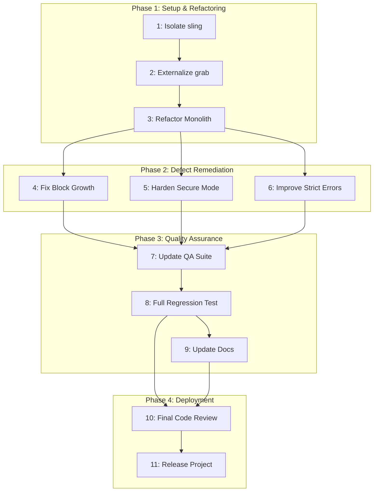

Of course. Here is the comprehensive project plan for refactoring and hardening the `sling` function, generated in the `claude-task-master` format.

### **Step 1: Project Description**

-   **Project Name:** `sling` Function Refactoring and Hardening
-   **Purpose:** To refactor the existing `sling` "super-setter" Rebol function to improve its maintainability, readability, and robustness by addressing architectural complexity and fixing subtle operational defects identified in a code review.
-   **Main Features:**
    -   Unified interface for modifying `block!`, `map!`, and `object!` data structures in place.
    -   `/path` refinement for deep, nested modifications.
    -   `/create` refinement for on-the-fly key/container creation.
    -   `/report` refinement to return a `logic!` indicating if a change occurred.
    -   `/strict` refinement for fail-fast error handling.
    -   `/secure` refinement for hardened, non-evaluative path traversal.
-   **Technical Constraints:** Must be written in Rebol/Bulk 3.19.0 (Oldes Branch) and remain self-contained, with the exception of externalizing the `grab` dependency to a shared library.
-   **What sets this software apart:** `sling` is unique in its ambition to provide a single, fire-and-forget function that handles a wide variety of mutation scenarios across multiple Rebol data types, with powerful optional refinements for complex operations. Its extensive, passing QA suite provides a solid foundation for this refactoring effort.

### **Step 2 & 3: Task List and Phases**

#### **Phase 1: Project Setup & Core Refactoring**
*This phase focuses on establishing a clean working environment and tackling the primary architectural issue: the monolithic nature of the `sling` function.*

| ID  | Title                               | Status  | Priority | Dependencies | Description                                                                                                                                                             | Validation Steps                                                                                               |
| --- | ----------------------------------- | ------- | -------- | ------------ | ----------------------------------------------------------------------------------------------------------------------------------------------------------------------- | -------------------------------------------------------------------------------------------------------------- |
| 1   | Isolate `sling` for Refactoring     | pending | Must     | None         | Create a new, dedicated development file (`sling-refactor-dev.r3`) containing only the `sling` function and its test harness to isolate the work from the original file. | Manual verification that the new file exists and contains the necessary code.                                  |
| 2   | Externalize `grab` Dependency       | pending | Must     | 1            | Remove the bundled `grab` function from the development file. Assume a canonical version is available and update the test harness if needed to load it from a library.  | Code review to confirm `grab` is removed. Run a test to ensure the external dependency is loaded correctly.     |
| 3   | Refactor Monolithic `/path` Logic   | pending | Must     | 2            | Break the main `sling/path` logic into smaller, single-purpose helper functions (e.g., `handle-block-step`, `handle-map-step`). The goal is to eliminate deep nesting.   | Code review confirming the monolith is broken down. Static analysis to check for reduced complexity (cyclomatic). |

#### **Phase 2: Defect Remediation & Hardening**
*With the core refactoring complete, this phase addresses the specific bugs and logical flaws identified in the review.*

| ID  | Title                          | Status  | Priority | Dependencies | Description                                                                                                                                                           | Validation Steps                                                                                                                                                                 |
| --- | ------------------------------ | ------- | -------- | ------------ | --------------------------------------------------------------------------------------------------------------------------------------------------------------------- | -------------------------------------------------------------------------------------------------------------------------------------------------------------------------------- |
| 4   | Fix Block Growth Logic         | pending | Must     | 3            | Correct the `insert/dup` logic to be unambiguous. The new implementation should explicitly use `'none` (the word) if that is the desired placeholder.                       | New unit test specifically for out-of-bounds block creation. Code review of the fix.                                                                                           |
| 5   | Harden Secure Mode Type Checks | pending | Should   | 3            | Improve the key-type validation in `/secure` mode. Replace brittle `any-word?` checks with more robust logic that explicitly handles allowed types (e.g., `word!`, `string!`). | New unit tests for `/secure` mode with various invalid key types. Code review.                                                                                                 |
| 6   | Implement Specific Strict Errors | pending | Should   | 3            | Enhance the `/strict` refinement to return specific error messages (e.g., `'index-out-of-bounds'`, `'key-not-found'`) instead of the generic `'sling: no change'`.          | Update existing `/strict` tests to assert the new, specific error IDs. Code review.                                                                                            |

#### **Phase 3: Quality Assurance & Documentation**
*This phase ensures that all changes are validated against the original functionality and that documentation is updated to reflect the new state.*

| ID  | Title                          | Status  | Priority | Dependencies | Description                                                                                                                              | Validation Steps                                                                                                                               |
| --- | ------------------------------ | ------- | -------- | ------------ | ---------------------------------------------------------------------------------------------------------------------------------------- | ---------------------------------------------------------------------------------------------------------------------------------------------- |
| 7   | Update & Enhance QA Suite      | pending | Must     | 4, 5, 6      | Integrate the new and updated unit tests from the previous phase into the main test harness. Ensure all original tests are still relevant. | Code review of the updated test suite.                                                                                                       |
| 8   | Execute Full Regression Test   | pending | Must     | 7            | Run the entire, updated QA suite against the refactored `sling` function. All tests must pass.                                           | Automated check: The test harness must output "✅ ALL TESTS PASSED".                                                                           |
| 9   | Update User Documentation      | pending | Could    | 8            | Review `sling-user-guide.md` to ensure it remains accurate after the refactoring. No functional changes were made, so this may be a no-op. | Manual verification and review of the user guide against the final code.                                                                       |

#### **Phase 4: Deployment**
*This final phase prepares the improved `sling` function for release.*

| ID  | Title                 | Status  | Priority | Dependencies | Description                                                                                             | Validation Steps                                                                                                                                                                                                                           |
| --- | --------------------- | ------- | -------- | ------------ | ------------------------------------------------------------------------------------------------------- | ------------------------------------------------------------------------------------------------------------------------------------------------------------------------------------------------------------------------------------------ |
| 10  | Final Code Review     | pending | Must     | 8, 9         | Conduct a final, holistic code review of the refactored `sling.r3` file, focusing on clarity and correctness. | Manual code review by a project maintainer.                                                                                                                                                                                                |
| 11  | Release as GitHub Project | pending | Must     | 10           | Merge the refactored code back into the main file, tag a new version (e.g., v0.3.0), and create release notes. | Manual verification of the merge on GitHub. Check that the new tag and release are visible.                                                                                                                                              |

### **Step 4: Dependency Graph**

### **Step 5: Risk Mitigation**

| Potential Risk                                  | Mitigation Strategy                                                                                                                                                                       |
| ----------------------------------------------- | ----------------------------------------------------------------------------------------------------------------------------------------------------------------------------------------- |
| **Regression During Refactoring**               | The existing comprehensive QA suite is the primary mitigation. It must be run after every significant change (Tasks 3, 4, 5, 6) and in its entirety during the final validation (Task 8).     |
| **Performance Degradation**                     | While the primary goal is maintainability, a basic performance benchmark (e.g., timing a loop of 10,000 deep path sets) should be run against the original version to ensure no major slowdowns. |
| **Incomplete Refactoring**                      | The final code review (Task 10) must specifically validate that the goals of the refactoring (breaking up the monolith, improving clarity) have been met. A static analysis tool could be used. |
| **Scope Creep**                                 | The tasks are tightly defined to address only the issues from the code review. Any new feature ideas that arise during the process should be deferred and documented for a future release.   |
